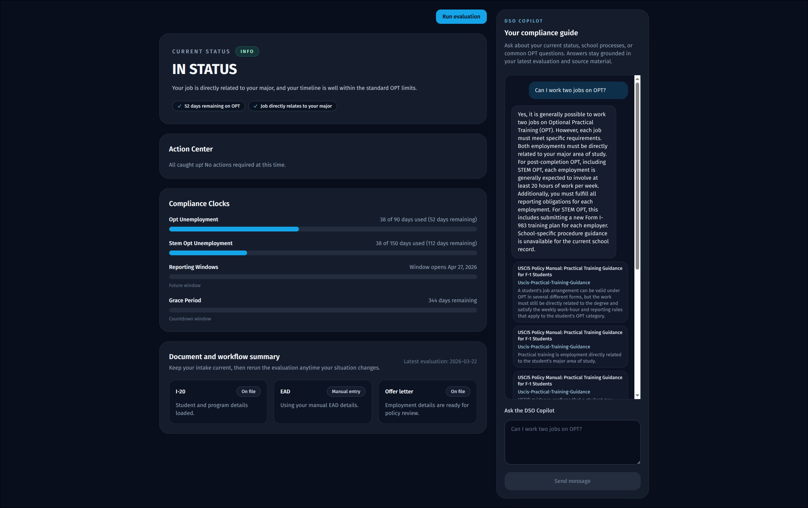
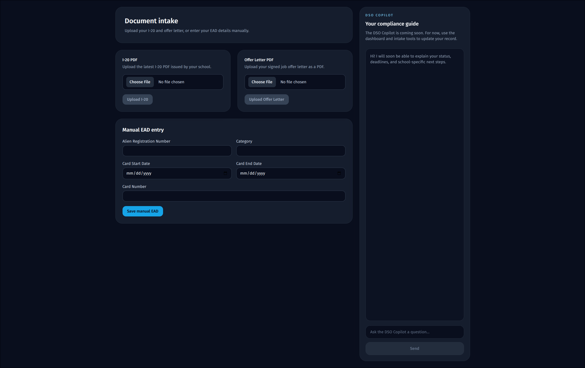
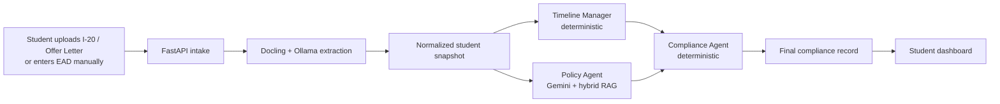
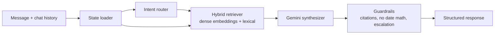

# VisaGuard

**An AI compliance copilot for F-1 international students — built so the LLM is never trusted with the parts it gets wrong.**

F-1 status is unforgiving. Miscount the 90-day OPT unemployment clock, misjudge whether a job is "directly related" to your major, or miss a reporting window, and a student can fall out of status. These are exactly the tasks general-purpose LLMs are worst at: date arithmetic, counting, and confidently inventing policy.

VisaGuard turns a student's documents (I-20, EAD, offer letter) into a reviewable compliance state and a grounded DSO copilot — but it deliberately keeps the model out of the dangerous work. Dates and clocks are computed deterministically. Policy answers must be backed by retrieved federal and university sources. Every LLM output is schema-validated before it can touch application state. The model synthesizes and explains; it never decides the math.

## Product





## How it works

VisaGuard runs two LangGraph workflows over a shared compliance state.

**1. Evaluation workflow** — converts uploaded documents into a frontend-ready compliance record:



**2. DSO copilot** — a separate conversational workflow that answers student questions using current compliance state plus retrieved guidance:



## Engineering decisions

The interesting parts of this project are the boundaries drawn around the LLM.

**The model is forbidden from doing date math.** Unemployment-day counts and timeline windows are computed by a deterministic Timeline Manager. When a student asks "how many unemployment days do I have left?", the copilot quotes the precomputed clock value or declines — it never lets the LLM calculate it. The single most error-prone, highest-stakes task is kept entirely out of the model.

**Policy verdicts require grounded evidence.** The Policy Agent won't return a "directly related" verdict unless retrieval surfaces *both* a matching CIP-code source and a federal policy source. No evidence, no verdict — it returns `insufficient_policy_evidence` instead of guessing.

**Hybrid retrieval, locally.** Both retrievers blend dense semantic similarity (local `nomic-embed-text` embeddings via Ollama, stored in ChromaDB) with lexical token overlap. Semantic recall catches paraphrased questions; lexical scoring keeps exact policy terminology (CIP codes, regulation numbers) from getting washed out.

**Every LLM output is schema-validated.** Model responses are parsed into Pydantic schemas before they enter workflow state. A malformed or out-of-contract response fails closed rather than propagating a bad value into a compliance decision.

**PII never leaves the machine during ingestion.** Document parsing (Docling) and extraction run on a local Ollama model, and direct identifiers — name, SEVIS ID, A-number, DOB, address — are redacted before text moves further down the pipeline.

**Deterministic core, LLM at the edges.** Timeline and compliance logic are plain, testable Python. Gemini is used only where judgment and explanation genuinely help: policy interpretation and conversational synthesis. This keeps behavior auditable and the failure modes understandable.

## Tech stack

- **Backend:** FastAPI, SQLAlchemy, Pydantic
- **Orchestration:** LangGraph (two workflows, SQLite-checkpointed)
- **LLMs:** Gemini for reasoning/synthesis; local Ollama (`qwen3:4b-instruct`) for ingestion; `nomic-embed-text` for embeddings
- **Retrieval:** ChromaDB vector store, hybrid dense + lexical scoring
- **Frontend:** React, Vite, Tailwind, TanStack Query
- **Testing:** Pytest, Vitest

## Testing

A suite of 150+ unit and integration tests covers the timeline engine, compliance decision matrix, hybrid retrieval, the no-math and escalation guardrails, schema validation, and both LangGraph workflows. Tests run fully offline — the Ollama embedder is injected, so retrieval logic is exercised without a live model.

```bash
uv run pytest
```

## Local run

```bash
uv sync --dev
cd frontend && npm install
```

Create `.env` from `.env.example` and set at least `GEMINI_API_KEY`, `OLLAMA_HOST`, `OLLAMA_MODEL`, and `OLLAMA_EMBEDDING_MODEL`.

Start Ollama and pull the ingestion and embedding models:

```bash
ollama serve
ollama pull qwen3:4b-instruct
ollama pull nomic-embed-text
```

Build the local indexes:

```bash
uv run python -m app.services.dso_agent.indexer
uv run python - <<'PY'
from pathlib import Path
from app.core.config import Settings
from app.services.embeddings import build_embedder
from app.services.policy_agent.indexer import build_policy_index

settings = Settings()
policy_root = Path(settings.policy_data_root)
build_policy_index(
    cip_dataset_path=policy_root / 'cip_codes.json',
    policy_sources_dir=policy_root / 'sources',
    output_path=Path(settings.policy_index_path),
    embedder=build_embedder(settings),
)
PY
```

Run the backend and frontend:

```bash
uv run --with uvicorn uvicorn app.main:app --host 127.0.0.1 --port 8000 --reload
cd frontend && npm run dev
```

## Output contract

The evaluation workflow produces a latest-state record with `overall_state`, `severity`, `action_plan`, and `audit_summary`. That record drives the dashboard directly and serves as immutable context for personalized DSO responses.

## Scope & limitations

VisaGuard is a portfolio project, not legal advice, and is intentionally scoped:

- Dev-mode auth: users are selected by `user_id` rather than a real auth flow.
- The DSO copilot currently ships one university corpus (NYU) plus federal guidance.
- Retrieval sources are curated into local markdown before indexing, not crawled live.

The copilot escalates high-risk situations to a human DSO or immigration attorney by design — it is built to assist, not to replace, professional advising.
