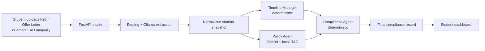
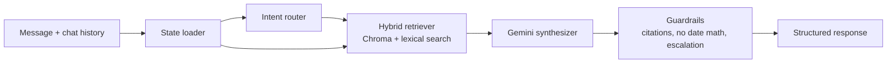

# VisaGuard

VisaGuard is an AI system for F-1 student compliance. It turns student documents and employment data into a reviewable compliance state, then exposes that state through a dashboard and a grounded DSO copilot.

Under the hood, the system combines document extraction, deterministic timeline evaluation, policy RAG, LangGraph orchestration, and schema-enforced LLM reasoning. The goal is not to make legal decisions with a single model call; it is to separate extraction, rules, retrieval, and synthesis into components that can be inspected, tested, and improved independently.

## Product


## Evaluation Engine

The evaluation engine converts uploaded documents and manual EAD data into a frontend-ready compliance record.



## DSO Copilot

The DSO copilot is a separate LangGraph workflow that answers student questions using current compliance state plus retrieved federal and university guidance.



## Engineering Highlights

- Hybrid compliance architecture: deterministic timeline and compliance agents paired with Gemini-based policy and conversational reasoning.
- Schema-enforced LLM boundaries: model outputs are validated before entering workflow state.
- Grounded retrieval: policy and DSO responses cite curated federal and university sources instead of relying on raw model recall.
- Explicit workflow orchestration: LangGraph coordinates both evaluation and conversational flows with persisted latest-state records and checkpointed execution history.
- Safety-first response design: the DSO copilot is not allowed to invent compliance math and escalates high-risk situations to a human DSO or immigration attorney.

## Stack

- FastAPI, SQLAlchemy, Pydantic
- LangGraph for workflow orchestration
- Ollama for document-ingestion extraction
- Gemini for non-ingestion reasoning
- ChromaDB + lexical reranking for retrieval
- React, Vite, Tailwind, TanStack Query
- Pytest and Vitest

## Local Run

```bash
uv sync --dev
cd frontend && npm install
```

Create `.env` from `.env.example`, then set at least:
- `GEMINI_API_KEY`
- `OLLAMA_HOST`
- `OLLAMA_MODEL`

Start Ollama and pull the ingestion model:

```bash
ollama serve
ollama pull qwen3:4b-instruct
```

Build the local indexes:

```bash
uv run python -m app.services.dso_agent.indexer
uv run python - <<'PY'
from pathlib import Path
from app.core.config import Settings
from app.services.policy_agent.indexer import build_policy_index

settings = Settings()
policy_root = Path(settings.policy_data_root)
build_policy_index(
    cip_dataset_path=policy_root / 'cip_codes.json',
    policy_sources_dir=policy_root / 'sources',
    output_path=Path(settings.policy_index_path),
)
PY
```

Run the backend and frontend:

```bash
uv run --with uvicorn uvicorn app.main:app --host 127.0.0.1 --port 8000 --reload
cd frontend && npm run dev
```

## Output Contract

The evaluation workflow produces a latest-state record with:
- `overall_state`
- `severity`
- `action_plan`
- `audit_summary`

That record drives the dashboard directly and serves as immutable context for personalized DSO responses.

## Notes

- The current app is dev-mode and still uses direct `user_id` selection instead of auth.
- Raw downloaded sources are curated into local markdown before they are indexed for retrieval.
- The DSO copilot currently supports one university corpus (NYU) plus federal guidance.
